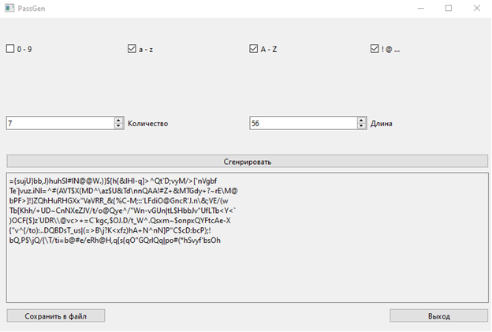

**Эта программа представляет собой генератор паролей с графическим интерфейсом пользователя (GUI), созданный с использованием библиотеки PyQt6 в Python. Программа предоставляет пользователю возможность генерировать случайные пароли заданной длины и количества, используя различные наборы символов.**

# Основные компоненты программы:

## Главное окно (MainWindow):

Отображает интерфейс программы и содержит элементы управления.

## Элементы управления:
* QSpinBox: Позволяет пользователю выбирать количество генерируемых паролей и их длину.
* QCheckBox: Позволяет пользователю выбирать типы символов, включаемые в генерируемые пароли (цифры, строчные и прописные буквы, специальные символы).
* QPushButton: Кнопки для генерации паролей, сохранения их в файл и выхода из программы.
* QPlainTextEdit: Представляет область для вывода сгенерированных паролей и также используется для сохранения в файл.

## Методы:
* generate_passwords(): Генерирует пароли на основе выбранных пользователем параметров и выводит их в QPlainTextEdit.
* save_to_file(): Позволяет пользователю сохранить сгенерированные пароли в текстовый файл.

Программа позволяет пользователю гибко настраивать параметры генерации паролей и обеспечивает удобный интерфейс для их создания и сохранения.